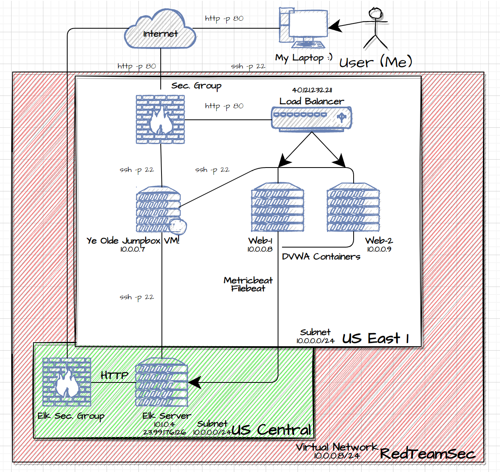

# CySec-BC-Project-1

The files in this repository were used to configure the network depicted below.

These files been tested and verify and used to generate a live ELK Stack deployment within Azure and they can be used to recreate this diagram. Portions of these files may be utilized to recreate portions of this project.

DVWA-Playbook.yml used to install DVWA Webservers.

- [`DVWA-Playbook.yml` Installs DVWA Webservers.](./DVWA-Containers/container-setup.yml)

- [`install-elk.yml` Installs ELK Stack Server.](./ELK-Server/elkserver.yml)

- [`filebeat-config.yml` Filebeat configuration modified and copied to the webservers as a  `filebeat.yml`.](./Filebeat/filebeat-config.yml)

- [`filebeat-playbook.yml` Installs Filebeat Syslog Service on the webservers.](./Filebeat/filebeat-config.yml)

- [`metricbeat-config.yml` Metricbeat configuration modified and copied to the webserver as a `metricbeat-config.yml`.](./Metricbeat/metricbeat-config.yml)

- [`metricbeat-playbook.yml` Installs Metricbeat service on webservers](./Metricbeat/meticbeat-playbook.yml)

This document contains the following details:

- Description of the Topology.
- Access Policies.
- ELK Configuration.
- Beats in Use.
- Machines Being Monitored.
- How to Use the Ansible Build.

### Description of the Topology

The main purpose of this network is to expose a load-balanced and monitored instance of DVWA, the D*mn Vulnerable Web Application.

Load balancing the services will be **reliable, efficient, and secure**.

- **What aspect of security do load balancers protect?** 
  * Help protect the network from malicious attacks like DDoS attacks. 
  * Shift the server load in the event one of the webservers is down or compromised.
  * Sharing the load
  * Regular rule updates to dynamically alter access.
  
<brk>

- **What is the advantage of a jump box?**

  * Acts as a buffer between the internet and your data. 
  * Stores data for Apps, Backups, and Logs.

Integrating an ELK server allows users to easily monitor the vulnerable VMs for changes to the  **network** and system **logs**.

- **What does Filebeat watch for?**

  * Watches and monitors the log files, user locations, collects log events, and forwards them either to Elasticsearch or Logstash for indexing. 

- **What does Metricbeat record?**

  * Takes metrics and statistics from services running on the server an
  * Ships collected data to a location that users specify, such as Elasticsearch or Logstash.

The configuration details of each machine may be found below.

| Name     | Function | IP Address | Operating System |
|----------|----------|------------|------------------|
| Zalinian |Worstation|Home IP| WINDOWS 10       |
|Jump-Box-Provisioner  | Gateway  | 10.0.0.7   | Linux UBUNTU 18.4|
| WEB-1    | DVWA     | 10.0.0.8   | LINUX UBUNTU 18.4|
| WEB-2    | DVWA     | 10.0.0.9   | LINUX UBUNTU 18.4|
|ELK-SERVER| ELK Stack| 10.1.0.4   | LINUX UBUNTU 18.4|

### Access Policies

- The machines on the internal network are not exposed to the public Internet. 

- Only the Jump box machine can accept connections from the Internet. Access to this machine is only allowed from the following IP addresses:

- Machines within the network can only be accessed by Jump Box with the private IP address 10.0.0.7

A summary of the access policies in place can be found in the table below.

| Name     | Publicly Accessible | Allowed IP Addresses  |
|----------|---------------------|---------------------- |
| AFIRIN   | YES                 |10.0.0.0/16 10.1.0.0/16| 
| Jump-Box-Provisioner | Yes                 |10.0.0.0/16 10.1.0.0/16|
| WEB-1    | NO                  |10.0.0.0/16 10.1.0.0/16|
| WEB-2    | NO                  |10.0.0.0/16 10.1.0.0/16| 
|ELK-SERVER| NO                  |10.0.0.0/16 10.1.0.0/16|

### Elk Configuration

**1. Name the playbook: Configure elk with Docker**

  - establish host, remote user, and root.

**2. Use apt and pip modules: Install Applications**

  - Docker.io, Python3-pip, Docker module.

**3. Use command module: Increase virtual memory**

  - command: sysctl -w vm.max_map_count=262144.

**4. Use sysctl module: Use more memory**

  - assigns more memory.

**5. Use docker-container module: download and launch a docker elk container**

  - down loads the elk container and assigns
 ports that ELK can run on:
     - published_ports:
          - 5601:5601
          - 9200:9200
          - 5044:5044

The following screenshot displays the result of running `docker ps` after successfully configuring the ELK instance.

### Target Machines & Beats
This ELK server is configured to monitor the following machines:

- **10.0.0.8**
- **10.0.0.9**

I have installed the following Beats on these machines:

- **Filebeat**
- **Metricbeat**

These Beats allow us to collect the following information from each machine:

- System log and application log details which include Web Traffic is gathered by Filebeat.
- CPU, Memory, Disk, Network, and other top-like statics are gathered with Metricbeat.

### Using the Playbook
In order to use the playbook, you will need to have an Ansible control node already configured. Assuming you have such a control node provisioned: 

SSH into the control node and follow the steps below:
- Copy the _____ file to _____.
- Update the _____ file to include...
- Run the playbook, and navigate to ____ to check that the installation worked as expected.

_TODO: Answer the following questions to fill in the blanks:_
- _Which file is the playbook? Where do you copy it?_
- _Which file do you update to make Ansible run the playbook on a specific machine? How do I specify which machine to install the ELK server on versus which to install Filebeat on?_
- _Which URL do you navigate to in order to check that the ELK server is running?

_As a **Bonus**, provide the specific commands the user will need to run to download the playbook, update the files, etc._
